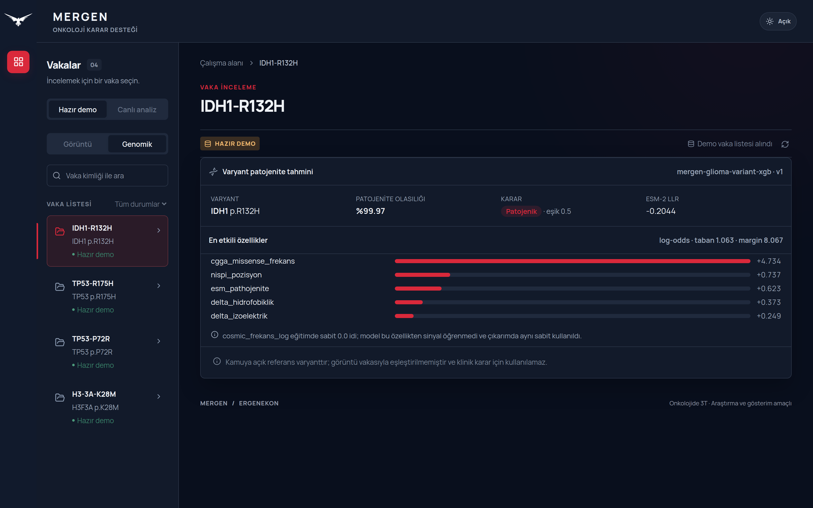
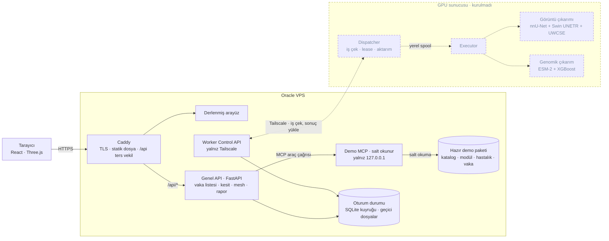

<div align="center">


# MERGEN

**Glioma için çok modlu onkoloji karar destek prototipi**

MR segmentasyonunu ve varyant patojenite tahminini tek çalışma alanında toplar.
ERGENEKON R+D Takımı · TEKNOFEST *Onkolojide 3T*

[](https://github.com/AbdullahZeynel/MERGEN/actions/workflows/checks.yml)
[](LICENSE)

</div>


> **Araştırma ve gösterim amaçlıdır.** Klinik kararda kullanılamaz. Ekrandaki
> MR görselleri UCSF-PDGM koleksiyonundan türetilmiş, kimliksizleştirilmiş ve
> kafatası çıkarılmış kamuya açık araştırma verisidir (CC BY 4.0, atıf:
> [`docs/ATTRIBUTIONS.md`](docs/ATTRIBUTIONS.md)). İki modülün çıktısını yan
> yana göstermek, doğrulanmış bir klinik füzyon modeli anlamına gelmez.

---

## İki modül

### Görüntü — MR tümör segmentasyonu

Dört MR modalitesinden (T1, T1c, T2, FLAIR) nnU-Net ve Swin UNETR
tahminlerinin UWCSE ile birleştirildiği bir topluluk. Çıktı BraTS etiket
şemasında üç bölgedir: kontrast tutan tümör, nekrotik çekirdek ve ödem.

Arayüz her kesiti üç düzlemde gezdirir, tahmin ile referans etiketini ayrı
katman olarak açıp kapatır ve tümör yüzeylerini WebGL ile döndürülebilir bir
modele çevirir. Modelin çevresindeki saydam kabuk MR ön planından yaklaşık
olarak üretilmiştir; korteks segmentasyonu değildir.

<table>
<tr>
<td width="42%"></td>
<td></td>
</tr>
</table>

### Genomik — missense varyant patojenite tahmini

Protein dizisinden ESM-2 (`esm2_t30_150M_UR50D`) log-likelihood oranı, AAindex
tabanlı fizikokimyasal delta özellikleri, göreli konum ve CGGA missense
frekansı hesaplanır; XGBoost bunları tek bir patojenite olasılığına indirir.
Her tahmin TreeSHAP ile açıklanır: hangi özelliğin margini ne kadar ittiği
gösterilir, katkıların toplamı taban değerle birlikte modelin ham çıktısına
eşitlenir ve bu toplamsallık arayüzde doğrulanır.



Model kendi zayıf noktalarını da gösterir — ekrandaki `cosmic_frekans_log`
notu buna örnektir. Denetim kaydı: [`docs/GENOMICS_AUDIT.md`](docs/GENOMICS_AUDIT.md).

---

## Sistem mimarisi

Hazır demo yolu uçtan uca çalışır: tarayıcı yalnızca genel API ile konuşur,
API disk yollarını hiç görmez, demo dosyalarını yalnız loopback'e bağlı
salt-okunur bir MCP servisi üzerinden okur. Canlı analiz yolunun VPS tarafı
(oturum, kuyruk, worker kontrol API'si, temizlik) hazırdır. GPU tarafında
dispatcher yazıldı; executor ve model adaptörleri henüz bağlanmamıştır.



Kesikli çizgiler henüz çalışır durumda olmayan parçaları gösterir: dispatcher
yazıldı ama bir hostta çalışmıyor, executor ve model adaptörleri yok. Geçici oturum
dosyalarını bir systemd zamanlayıcısı süresi dolunca siler.

| Bileşen | Durum |
|---|---|
| React arayüzü, 2D/3D görüntüleyici, genomik panel | Çalışıyor |
| Genel API — hazır demo uçları | Çalışıyor |
| Demo MCP (salt okunur, loopback) | Çalışıyor |
| Genomik çıkarım adaptörü (tek varyant, çevrimdışı ESM) | Çalışıyor |
| Oturum, iş kuyruğu, worker kontrol API'si, temizlik | Yazıldı, worker'sız |
| GPU dispatcher ve yerel spool sözleşmesi | Yazıldı; executor'sız, gerçek hostta denenmedi |
| GPU executor ve canlı model adaptörleri | Planlanan |
| Sohbet asistanı | Ertelendi |

### Hazır demo paketi

Katalog modül ve hastalık kırılımına göre büyür; görüntü ve genomik vakalar
ayrı koleksiyonlardır ve birbirine eşleştirilmez.

```
catalog.json
├── imaging/glioma/manifest.json
│   └── cases/UCSF-PDGM-0004/
│       ├── slices/{axial,coronal,sagittal}/…   MR kesitleri
│       ├── overlays/{prediction,ground_truth}/ segmentasyon katmanları
│       └── mesh-<sha256>.glb                   3D tümör yüzeyleri
└── genomics/glioma-variant-pathogenicity/manifest.json
    └── cases/IDH1-R132H/
        ├── input.json        varyant girdisi
        ├── result.json       olasılık ve karar
        └── explanation.json  SHAP katkıları
```

Paketin kendisi Git dışıdır; nasıl üretildiği
[`docs/DEMO_SERVICES.md`](docs/DEMO_SERVICES.md) içindedir.

---

## Çalıştırma

Üç süreç gerekir: MCP (9010), API (9000), Vite (5173).

```bash
python -m venv backend/.venv
backend/.venv/bin/pip install -r backend/requirements.txt

MERGEN_DEMO_ROOT="$PWD/.local/demo-v3" backend/.venv/bin/python mcp/server.py
backend/.venv/bin/python -m uvicorn backend.api:app --host 127.0.0.1 --port 9000

cd frontend && npm ci && npm run dev
```

Arayüz `http://127.0.0.1:5173/` adresinde açılır. Ayrıntılı kurulum, demo
paketinin üretimi ve doğrulama adımları
[`docs/DEMO_SERVICES.md`](docs/DEMO_SERVICES.md) içindedir; VPS dağıtımı
[`infra/vps/README.md`](infra/vps/README.md) altındadır.

Testler:

```bash
cd frontend && npm run check                    # vitest + typecheck + build
python -m unittest backend.test_demo backend.test_live
python -m unittest discover -s infra/ci -p 'test_*.py'
python infra/ci/repo_guard.py                   # sır, adres ve büyük dosya taraması
```

Model ağırlıkları, MR veri kümesi ve genomik eğitim verisi Git klonuyla
gelmez; konumları [`docs/LOCAL_ASSETS.md`](docs/LOCAL_ASSETS.md) içinde
listelenmiştir. `main.py` genomik modeli **eğitir**, görüntü betikleri
**değerlendirme** yapar — bunlar servis komutu değildir.

---

## Depo düzeni

| Yol | Sorumluluk |
|---|---|
| `frontend/` | React vaka arayüzü; `frontend/legacy/` eski Three.js dashboard |
| `backend/` | Genel API, canlı oturum, worker kontrol API'si, temizlik |
| `mcp/` | Salt okunur demo araçları; disk yollarını dışarı vermez |
| `mergen_dispatcher/` | GPU hostunda VPS'ten iş çeken dispatcher; model çalıştırmaz |
| `mergen_spool/` | Dispatcher ile executor arasındaki yerel spool sözleşmesi |
| `models/imaging/` | Görüntü algoritmaları, çıkarım ve değerlendirme betikleri |
| `models/VeriOdakliCozum/` | Genomik paket; eğitim, çıkarım adaptörü, fixture'lar |
| `infra/` | VPS, Caddy, Tailscale ve CI koruması |
| `docs/PLAN.md` | Mimari kararlar ve çalışma sırası |
| `docs/SYSTEM_SPRINTS.md` | Canlı oturum, worker ve entegrasyon sprintleri |
| `docs/GENOMICS_AUDIT.md` | Genomik modelin denetimi ve bilinen sınırları |
| `docs/LOCAL_ASSETS.md` | Git dışı ağırlık, veri ve sonuç konumları |
| `docs/ATTRIBUTIONS.md` | Veri kümesi atıfları ve üçüncü taraf lisansları |

---

## Doğrulama ve sınırlar

Bu depo, ölçmediği hiçbir şeyi iddia etmemeye çalışır.

- **Yayımlanmış performans metriği yok.** Segmentasyon ve patojenite skorları
  bağımsız bir test kümesinde raporlanana kadar Dice, AUC ve benzeri sayılar
  README'de yer almayacak.
- **Genomik model klinik olarak doğrulanmadı.** Çalışma zamanı yeniden
  üretilebilir ve sessiz varsayılan içermez; bu doğruluk kanıtı değildir.
  Bilinen zayıflıklar (baskın CGGA gen kimliği sinyali, eğitimde sabit kalan
  bir özellik, benign bir polimorfizmin yanlış sınıflanması)
  [`docs/GENOMICS_AUDIT.md`](docs/GENOMICS_AUDIT.md) içinde açıkça yazılıdır.
- **Demo görselleri kimliksizleştirilmiş insan araştırma verisidir.** Görüntü
  vakaları UCSF-PDGM koleksiyonundan gelir: TCIA tarafından kimliksizleştirilmiş
  ve kafatası çıkarılmış, CC BY 4.0 ile yayımlanmış MR verisi. Kişisel
  tanımlayıcı içermez. Genomik kayıtlar UniProtKB referans dizilerinden
  türetilir; görüntü ve genomik vakalar aynı kişiye ait değildir ve
  eşleştirilmez.
- **Canlı hata sessizce demoya düşmez.** Servis yanıt vermezse arayüz bunu
  açıkça söyler, hazır sonucu canlı sonuç gibi göstermez.

Katkı vermeden önce [`AGENTS.md`](AGENTS.md) ve [`docs/PLAN.md`](docs/PLAN.md)
okunmalıdır: kapsamı küçük tutun, bulguları kaynakla doğrulayın ve gerçekten
çalıştırdığınız kontrolleri belirtin.

---

## Lisans

Kök [LICENSE](LICENSE) dosyası **Apache License 2.0**'dır ve ERGENEKON
tarafından üretilen özgün kaynak kodu ile dokümantasyonu kapsar. Apache-2.0,
MIT kadar izin verici; açık bir patent hakkı devri içerdiği için model ve
algoritma taşıyan bir projede tercih edildi.

Depoda üçüncü taraf kaynak kodu da bulunur ve **kendi dosya başlıkları ile
lisans bildirimleriyle birlikte** dağıtılır; kök lisans onların yerine geçmez:

| Yol | Kaynak | Lisans |
|---|---|---|
| `models/imaging/SwinUNETR_BRATS21/` | MONAI Consortium | Apache-2.0 (dosya başlıklarında) |
| `models/imaging/brats_mri_segmentation/` | MONAI model paketi | Apache-2.0 (kendi `LICENSE` dosyası) |

Bağımlılık olarak kullanılan ve depoda kaynağı bulunmayan bileşenler:

| Bileşen | Şart |
|---|---|
| nnU-Net, MONAI, XGBoost | Apache-2.0 |
| ESM-2 kaynak kodu | MIT (Meta AI) |
| ESM-2 model ağırlıkları | Git deposunda yer almaz; indirme sırasında ilgili model dağıtım şartları ayrıca doğrulanmalıdır |
| UCSF-PDGM MR veri kümesi | CC BY 4.0 — atıf zorunlu |
| CGGA genomik verisi | CGGA veri kullanım şartları |

Veri atıfları, DOI'ler ve tam liste:
[`docs/ATTRIBUTIONS.md`](docs/ATTRIBUTIONS.md). Veri kümelerini ve model
ağırlıklarını kendi kaynağından, kendi şartlarıyla edinin.
