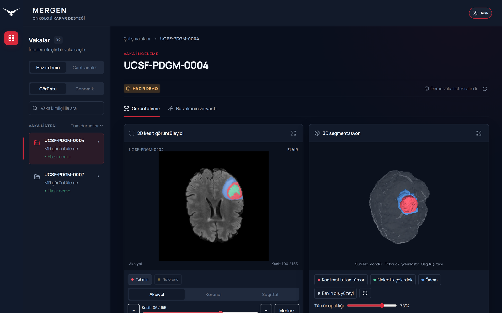
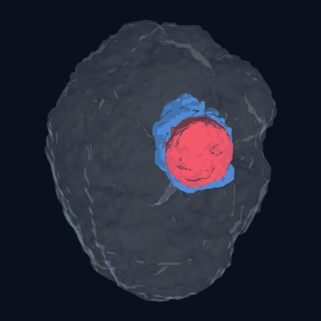
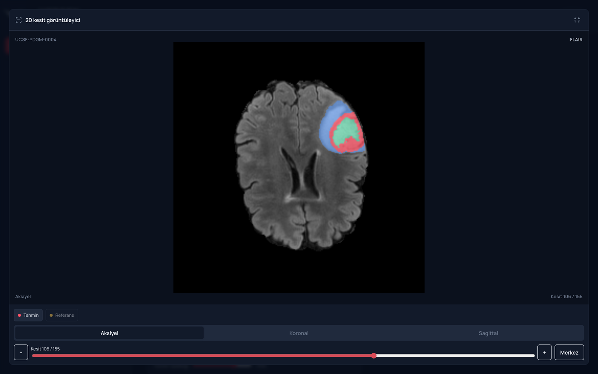
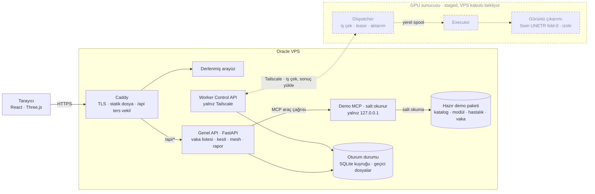

<div align="center">


# MERGEN

**Glioma MR görüntüleme karar destek prototipi**

MR segmentasyonunu 2B kesitler ve etkileşimli 3B yüzeylerle tek çalışma alanında sunar.
ERGENEKON R+D Takımı · TEKNOFEST *Onkolojide 3T*

[](https://github.com/AbdullahZeynel/MERGEN/actions/workflows/checks.yml)
[](LICENSE)

</div>



> **Araştırma ve gösterim amaçlıdır.** Klinik kararda kullanılamaz. Ekrandaki
> MR görselleri UCSF-PDGM koleksiyonundan türetilmiş, kimliksizleştirilmiş ve
> kafatası çıkarılmış kamuya açık araştırma verisidir (CC BY 4.0, atıf:
> [`docs/ATTRIBUTIONS.md`](docs/ATTRIBUTIONS.md)).

---

## Görüntüleme

### Görüntü — MR tümör segmentasyonu

Dört MR modalitesinden (T1, T1c, T2, FLAIR) nnU-Net ve Swin UNETR
tahminlerinin UWCSE ile birleştirildiği bir topluluk. Çıktı BraTS etiket
şemasında üç bölgedir: kontrast tutan tümör, nekrotik çekirdek ve ödem.

Ekrandaki hazır demo vakaları bu topluluktan gelir. Canlı GPU yolu bugün
yalnız Swin UNETR fold-0'ı çalıştırır; sonuçlar bu nedenle farklı model
kimliği taşır (`swin-unetr-brats21` yerine demo `uwcse-full`) ve topluluk
çıktısıyla aynı sayılmaz.

Arayüz her kesiti üç düzlemde gezdirir, tahmin ile referans etiketini ayrı
katman olarak açıp kapatır ve tümör yüzeylerini WebGL ile döndürülebilir bir
modele çevirir. Modelin çevresindeki saydam kabuk MR ön planından yaklaşık
olarak üretilmiştir; korteks segmentasyonu değildir.

<table>
<tr>
<td width="42%"></td>
<td></td>
</tr>
</table>

## Sistem mimarisi

Hazır demo yolu uçtan uca çalışır: tarayıcı yalnızca genel API ile konuşur,
API disk yollarını hiç görmez, demo dosyalarını yalnız loopback'e bağlı
salt-okunur bir MCP servisi üzerinden okur. Canlı analiz yolunun VPS tarafı
(oturum, kuyruk, worker kontrol API'si, temizlik) hazırdır. GPU tarafında
dispatcher, executor ve izole Swin UNETR runner yazılmıştır; runner sentetik
bir fixture ile gerçek GPU üzerinde ölçülmüştür, VPS kuyruğuyla uçtan uca kabul
testi henüz yapılmamıştır.



Kesikli çizgiler henüz canlı açılmamış yolu gösterir: servisler GPU hostunda
staged durumdadır ve enable edilmemiştir. Model runner'ı sentetik bir fixture
ile gerçek GPU üzerinde uçtan uca çalıştı; kalan iş VPS kuyruğuyla uçtan uca
kabul. Geçici oturum dosyalarını bir systemd zamanlayıcısı süresi dolunca
siler.

| Bileşen | Durum |
|---|---|
| React arayüzü, 2D/3D görüntüleyici | Çalışıyor |
| Genel API — hazır demo uçları | Çalışıyor |
| Demo MCP (salt okunur, loopback) | Çalışıyor |
| Oturum, iş kuyruğu, worker kontrol API'si, temizlik | Yazıldı, worker'sız |
| GPU dispatcher, executor ve yerel spool sözleşmesi | Yazıldı ve hostta staged; servisler henüz açılmadı |
| Canlı Swin UNETR model runner | Gerçek GPU'da sentetik fixture ile uçtan uca çalıştı; VPS kuyruğuyla kabul bekliyor |
| Sohbet asistanı | Ertelendi |

### Hazır demo paketi

Katalog modül ve hastalık kırılımına göre büyüyebilir; bugün yalnız görüntü
koleksiyonu desteklenir.

```
catalog.json
├── imaging/glioma/manifest.json
│   └── cases/UCSF-PDGM-0004/
│       ├── slices/{axial,coronal,sagittal}/…   MR kesitleri
│       ├── overlays/{prediction,ground_truth}/ segmentasyon katmanları
│       └── mesh-<sha256>.glb                   3D tümör yüzeyleri
```

Paketin kendisi Git dışıdır; nasıl üretildiği
[`docs/DEMO_SERVICES.md`](docs/DEMO_SERVICES.md) içindedir.

---

## Çalıştırma

Üç süreç gerekir: MCP (9010), API (9000), Vite (5173).

```bash
python -m venv backend/.venv
backend/.venv/bin/pip install -r backend/requirements.txt

MERGEN_DEMO_ROOT="$PWD/.local/demo-v3" backend/.venv/bin/python mcp/server.py
backend/.venv/bin/python -m uvicorn backend.api:app --host 127.0.0.1 --port 9000

cd frontend && npm ci && npm run dev
```

Arayüz `http://127.0.0.1:5173/` adresinde açılır. Ayrıntılı kurulum, demo
paketinin üretimi ve doğrulama adımları
[`docs/DEMO_SERVICES.md`](docs/DEMO_SERVICES.md) içindedir; VPS dağıtımı
[`infra/vps/README.md`](infra/vps/README.md) altındadır.

Testler:

```bash
cd frontend && npm run check                    # vitest + typecheck + build
python -m unittest backend.test_demo backend.test_live
python -m unittest discover -s infra/ci -p 'test_*.py'
python infra/ci/repo_guard.py                   # sır, adres ve büyük dosya taraması
```

Model ağırlıkları ve MR veri kümesi Git klonuyla gelmez; konumları
[`docs/LOCAL_ASSETS.md`](docs/LOCAL_ASSETS.md) içinde listelenmiştir. Görüntü
betikleri değerlendirme yapar; bunlar servis komutu değildir.

---

## Depo düzeni

| Yol | Sorumluluk |
|---|---|
| `frontend/` | React vaka arayüzü |
| `backend/` | Genel API, canlı oturum, worker kontrol API'si, temizlik |
| `mcp/` | Salt okunur demo araçları; disk yollarını dışarı vermez |
| `mergen_dispatcher/` | GPU hostunda VPS'ten iş çeken dispatcher; model çalıştırmaz |
| `mergen_executor/` | GPU hostunda işi spool'dan alıp adaptöre veren executor; ağ ve token yok |
| `mergen_spool/` | Dispatcher ile executor arasındaki yerel spool sözleşmesi |
| `mergen_imaging/` | İzole model venv'inde çalışan canlı Swin UNETR runner'ı |
| `models/imaging/` | Görüntü algoritmaları, çıkarım ve değerlendirme betikleri |
| `infra/` | VPS, Caddy, Tailscale ve CI koruması |
| `docs/PLAN.md` | Mimari kararlar ve çalışma sırası |
| `docs/SYSTEM_SPRINTS.md` | Canlı oturum, worker ve entegrasyon sprintleri |
| `docs/LOCAL_ASSETS.md` | Git dışı ağırlık, veri ve sonuç konumları |
| `docs/ATTRIBUTIONS.md` | Veri kümesi atıfları ve üçüncü taraf lisansları |

---

## Doğrulama ve sınırlar

Bu depo, ölçmediği hiçbir şeyi iddia etmemeye çalışır.

- **Yayımlanmış performans metriği yok.** Segmentasyon skorları
  bağımsız bir test kümesinde raporlanana kadar Dice, AUC ve benzeri sayılar
  README'de yer almayacak.
- **Demo görselleri kimliksizleştirilmiş insan araştırma verisidir.** Görüntü
  vakaları UCSF-PDGM koleksiyonundan gelir: TCIA tarafından kimliksizleştirilmiş
  ve kafatası çıkarılmış, CC BY 4.0 ile yayımlanmış MR verisi. Kişisel
  tanımlayıcı içermez.
- **Canlı hata sessizce demoya düşmez.** Servis yanıt vermezse arayüz bunu
  açıkça söyler, hazır sonucu canlı sonuç gibi göstermez.

Katkı vermeden önce [`AGENTS.md`](AGENTS.md) ve [`docs/PLAN.md`](docs/PLAN.md)
okunmalıdır: kapsamı küçük tutun, bulguları kaynakla doğrulayın ve gerçekten
çalıştırdığınız kontrolleri belirtin.

---

## Lisans

Kök [LICENSE](LICENSE) dosyası **Apache License 2.0**'dır ve ERGENEKON
tarafından üretilen özgün kaynak kodu ile dokümantasyonu kapsar. Apache-2.0,
MIT kadar izin verici; açık bir patent hakkı devri içerdiği için model ve
algoritma taşıyan bir projede tercih edildi.

Depoda üçüncü taraf kaynak kodu da bulunur ve **kendi dosya başlıkları ile
lisans bildirimleriyle birlikte** dağıtılır; kök lisans onların yerine geçmez:

| Yol | Kaynak | Lisans |
|---|---|---|
| `models/imaging/SwinUNETR_BRATS21/` | MONAI Consortium | Apache-2.0 (dosya başlıklarında) |
| `models/imaging/brats_mri_segmentation/` | MONAI model paketi | Apache-2.0 (kendi `LICENSE` dosyası) |

Bağımlılık olarak kullanılan ve depoda kaynağı bulunmayan bileşenler:

| Bileşen | Şart |
|---|---|
| nnU-Net, MONAI | Apache-2.0 |
| UCSF-PDGM MR veri kümesi | CC BY 4.0 — atıf zorunlu |

Veri atıfları, DOI'ler ve tam liste:
[`docs/ATTRIBUTIONS.md`](docs/ATTRIBUTIONS.md). Veri kümelerini ve model
ağırlıklarını kendi kaynağından, kendi şartlarıyla edinin.
