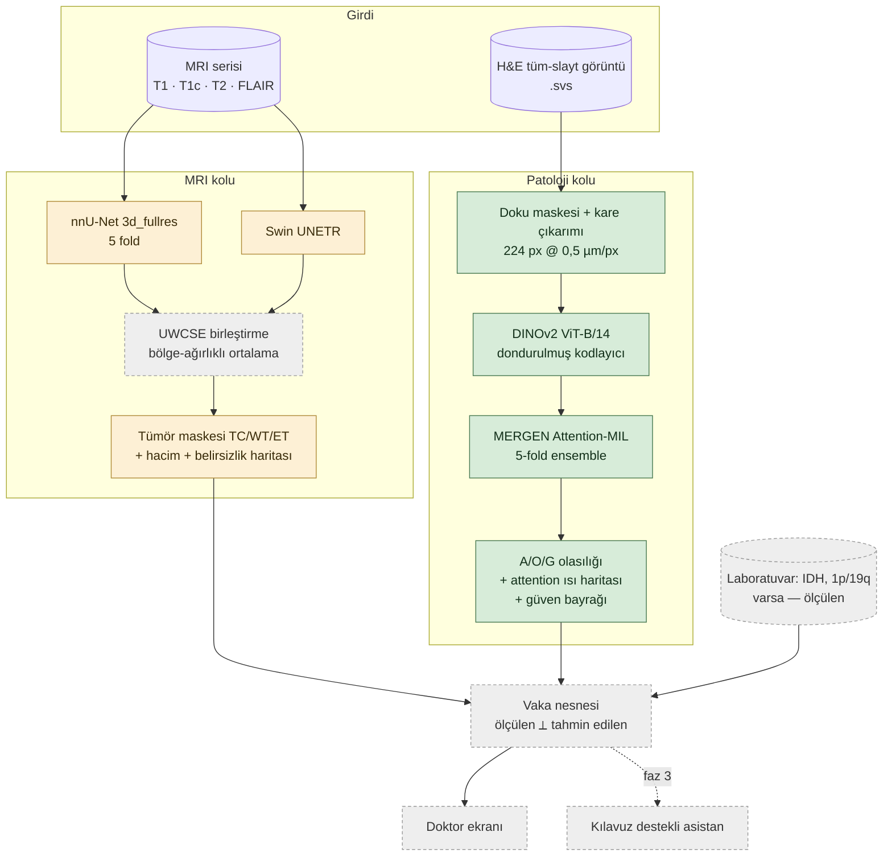
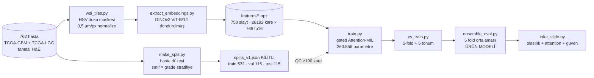
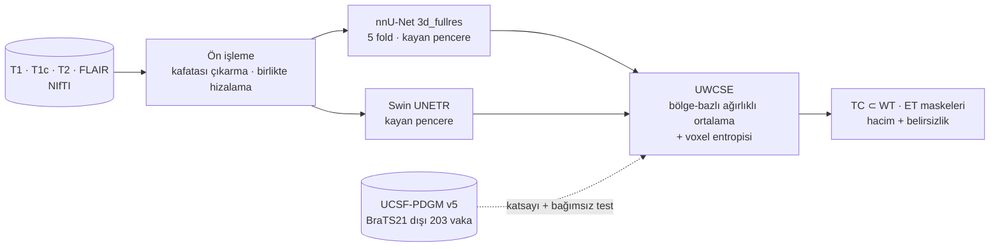

<!-- ARŞİV SÜRÜMÜ — cutoff: Gazi Brains 2020 çalışması ÖNCESİ sistem durumu.
     5.9 ve 5.10 bölümleri (Gazi Brains benchmark'ı, ön işleme düzeltmesi ve Gazi ince ayarı)
     kapsam dışı olduğu için bu sürümden çıkarılmıştır. Canlı sürüm depo kökündedir. -->

# MERGEN — Sistem Mimarisi

> Bu dosya `scripts/build_architecture_doc.py` tarafından **üretilir**. Elle düzenlemeyin;
> çıktı üreten her koşudan sonra betiği yeniden çalıştırın. Üretim: 2026-09-17 00:57 UTC · commit `9c330e3`.

Glioma karar-destek prototipi. İki bağımsız görüntü kolu (MRI ve patoloji) bir vaka
nesnesinde birleşir; doktora **ölçülen** ile **tahmin edilen** ayrı ayrı gösterilir.

## 1. Uçtan uca akış



Renkler: yeşil = eğitildi/ölçüldü ve çalışıyor · sarı = ağırlıklar hazır, MERGEN ölçümü
eksik · gri kesik = henüz yapılmadı.

## 2. Model envanteri

`models/registry/index.yaml` dosyasından üretildi. Durum sözlüğü aynı dosyadadır.

| Model | Alan | Ürün rolü | Durum | Varlık |
|---|---|---|---|---|
| `1p19qnet` | pathology | redundant_reference | smoke_tested | 5/5 |
| `attention-deep-mil` | pathology | architecture_reference | code_reference | 3/3 |
| `dinov2-vitb14` | pathology | wsi_tile_encoder | smoke_tested | 2/2 (333 MiB) |
| `doctor-rag` | knowledge | phase3_doctor_assistant | deferred | 0/0 |
| `gmap` | pathology | phase2_candidate | weights_verified_dependencies_gated | 8/8 (142 MiB) |
| `iucompath-glioma-subtyping` | pathology | offline_benchmark | metadata_only | 18/18 (2 MiB) |
| `legacy-esm2-xgboost` | genomics | out_of_core_scope | deferred | 0/0 |
| `mergen-uwcse` | mri | primary_mri_output | coefficients_fitted_evaluated | 0/0 |
| `mergen-wsi-attention-mil` | pathology | primary_wsi_output | trained_evaluated | 3/3 |
| `mil-pretrained` | pathology | optional_initialization | weights_verified_license_unclear | 12/12 (64 MiB) |
| `nnunet-brats21` | mri | primary_mri_expert | smoke_tested | 9/9 (2,346 MiB) |
| `prov-gigapath` | pathology | dependency_of_tum | gated_access_required | 0/0 |
| `roam` | pathology | offline_reference | weights_verified | 7/7 (168 MiB) |
| `swin-unetr-brats21` | mri | secondary_mri_expert | smoke_tested | 2/2 (465 MiB) |
| `tum-radio-path-moe-mamba` | multimodal | ready_aog_candidate | weights_verified_dependencies_gated | 22/22 (11 MiB) |
| `uni` | pathology | dependency_of_gmap | gated_access_required | 0/0 |

Ürün kullanımı: **core** = vaka akışında çalışır · **conditional** = erişim/lisans
koşuluna bağlı · **reference** = karşılaştırma ve doğrulama amaçlı, ürüne girmez.

## 3. Patoloji kolu (çalışır durumda)



### Kararlar ve gerekçeleri

| Konu | Karar | Neden |
|---|---|---|
| Split birimi | Hasta | Aynı hastanın kareleri farklı bölmelere düşmesin |
| Stratifikasyon | sınıf × grade | TCGA'da G sınıfı neredeyse hep grade 4; aksi halde model grade öğrenir |
| Kodlayıcı | DINOv2 dondurulmuş | 762 slayt uçtan uca eğitim için az; yalnız 264 K parametre eğitilir |
| Kare sayısı | ≤8192 saklanır, eğitimde 4096 rastgele | Bellek + veri artırma; değerlendirmede tümü |
| Sınıf dengesizliği | Ağırlıklı cross-entropy | 345 G / 255 A / 162 O |
| QC | <100 doku karesi dışlanır | 10 soluk/boş slayt (4 doku yok, 6 az doku) |
| Ürün modeli | 5-fold ensemble | Tek modele göre testte +0,020 makro-F1, G'ye kayma azalır |

## 4. MRI kolu (ağırlıklar hazır, MERGEN ölçümü sürüyor)



**Neden iki ağ:** nnU-Net BraTS21 birincisi, Swin UNETR farklı bir tümleşim yanlılığına sahip;
UWCSE ikisinin olasılık haritalarını bölge bazlı ağırlıkla birleştirir ve voxel entropisinden
belirsizlik haritası üretir. UWCSE bir ağ değildir, öğrenilen bir parametresi yoktur —
ağırlıkları ayrı bir doğrulama kümesinde bir kez sabitlenir.

### Bu makinedeki smoke ölçümleri (MSD Task01, 8 vaka)

Bunlar **çalışırlık ve kaynak ölçümleridir**, bağımsız klinik değerlendirme değildir:
kullanılan vakalar eğitim verisiyle örtüşebilir.

| Model | Dice TC | Dice WT | Dice ET | Vaka/s | Tepe VRAM |
|---|---:|---:|---:|---:|---:|
| nnU-Net (5 fold) | 0.798 | 0.851 | 0.754 | 20.18 s | 3135 MiB |
| Swin UNETR (fold 0) | 0.769 | 0.832 | 0.842 | 6.75 s | 4411 MiB |

### UCSF-PDGM bağımsız test kümesi (indiriliyor)

- Seçim: BraTS21 segmentasyon kohortunda **olmayan** 203 vaka
  (nnU-Net ve Swin UNETR BraTS21 Training üzerinde eğitildi; dürüst bağımsız test ancak bunlarla olur).
- İndirilen dosya: **1015 / 1015** (%100.0) · diskte 2.37 GiB
- Son güncelleme: 2026-09-15T04:41:30+00:00

Seçici indirme: yayımlanan paket 142 GB, çünkü her vaka 210 MB ham difüzyon serisi taşıyor.
UWCSE için gereken dört yapısal hacim + tümör segmentasyonu vaka başına 10,75 MB —
yani ~2,2 GB. Ayrıntı: `models/imaging/ucsf/download_ucsf.py` (yalnız GPU hostunda).

## 5. Ölçülen sonuçlar

### 5.1 Patoloji — A/O/G sınıflandırma

Tüm sayılar MERGEN'in kendi kilitli bölmesinde ölçüldü. Kilitli test **iki kez** açıldı
(önce tek model `mil_v1`, sonra dondurulmuş ensemble) ve ikisi birlikte raporlanır.

| Koşu | Bölme | n | makro-F1 | %95 GA | dengeli doğruluk | AUROC | MCC |
|---|---|---:|---:|---|---:|---:|---:|
| `ensemble_cv_v1` **←ürün** | test | 113 | **0.790** | 0.708–0.863 | 0.788 | 0.909 | 0.696 |
| `ensemble_seeds_v1` | val | 115 | **0.886** | 0.815–0.944 | 0.886 | 0.958 | 0.837 |
| `mil_v1` | test | 113 | **0.770** | 0.679–0.847 | 0.761 | 0.903 | 0.671 |
| `mil_v1` | val | 115 | **0.881** | 0.815–0.936 | 0.877 | 0.960 | 0.824 |

### 5.2 Varyans ve çapraz doğrulama (test'e dokunmaz)

| Koşu | Ne ölçer | n | makro-F1 |
|---|---|---:|---|
| `seeds_v1` | kilitli split, 5 tohum (val) | 115 | 0.864 ± 0.020 |
| `seeds_v1` ensemble | 5 tohum ortalaması (val) | 115 | 0.886 |
| `cv_v1` (tohum 1) | 5-fold, fold başına | 127 | 0.826 ± 0.023 |
| `cv_v1` (tohum 1) | **out-of-fold havuz — en güvenilir tahmin** | 639 | **0.827** [0.793–0.857] |

**Doğrulama skorları neden ürün iddiası değil:** en iyi epoch kendi doğrulama verisinde
seçildiği için şişkinler. Bu şişkinlik eğitim loglarından ölçüldü (en iyi epoch eksi
10. epoch sonrasının medyanı): 10 koşuda **+0,046 ± 0,014** makro-F1. OOF 0,827'den
düşülünce ≈0,78 kalır ve kilitli testte ölçülen 0,770 (tek model) / 0,790 (ensemble)
ile örtüşür. Yani val→test farkı bir genelleme çöküşü değil, seçim şişkinliğidir.

### 5.3 Kalibrasyon ve belirsizlik bayrağı

- Sıcaklık ölçekleme **kullanılmıyor** (T = 1.0): ensemble zaten kalibre
  (val ECE 0,071; tek modelde 0,097) ve sıcaklık kestirimi ECE'yi kötüleştiriyordu.
- Çekimserlik eşiği: ham top-2 olasılık farkı < **0.45**, doğrulamada seçildi.

| | kapsam | tutulanlarda doğruluk | çekimser | yakalanan hata |
|---|---:|---:|---:|---:|
| doğrulama (seçim) | 0.861 | 0.929 | 16 | — |
| kilitli test (okuma) | 0.805 | 0.835 | 22 | 7/22 |

**Bu bayrak bir güvenlik ağı değildir.** Testte vakaların ~%20'sini uzmana yolluyor ve
hataların yalnız üçte birini yakalıyor. Sinyal gerçek ama orta güçte: eşikten bağımsız
hata-tespit AUROC **0,745 [0,69–0,80]** (OOF, n=639).

### 5.4 MRI — tümör segmentasyonu (bağımsız test)

**`uwcse_v3` (ürünün kullandığı katsayılar)** · UCSF-PDGM v5, BraTS21 segmentasyon kohortu dışı vakalar · test **n=172** vaka (ağırlıkların ölçüldüğü 30 vaka — WHO grade'e orantılı tabakalı (WHO CNS Grade), havuz 202, tohum 42).

nnU-Net ve Swin UNETR **BraTS21 Training** üzerinde eğitildi; buradaki vakalar o kohortun
dışındadır, dolayısıyla bu gerçek bir bağımsız testtir — smoke Dice'larından farklı olarak.

| Varyant | TC | WT | ET | Ortalama | %95 GA | iyi tek modele göre |
|---|---:|---:|---:|---:|---|---|
| nnUNet | 0.5895 | 0.9287 | 0.5962 | **0.7048** | 0.6617–0.7467 | -0.1558 [-0.1958, -0.1206] · 0/172 |
| SwinUNETR | 0.7617 | 0.9074 | 0.8262 | **0.8318** | 0.7993–0.8637 | -0.0288 [-0.0459, -0.0149] · 0/172 |
| V0_Naive | 0.7564 | 0.9175 | 0.8130 | **0.8289** | 0.7957–0.8617 | -0.0317 [-0.0484, -0.0167] · 78/172 |
| V1_CSW | 0.7631 | 0.9299 | 0.8276 | **0.8402** | 0.8086–0.8714 | -0.0204 [-0.0346, -0.0085] · 88/172 |
| V2_CSW+UNC | 0.7640 | 0.9288 | 0.8285 | **0.8404** | 0.8086–0.8715 | -0.0202 [-0.0344, -0.0081] · 88/172 |
| V3_CSW+PP | 0.8121 | 0.9299 | 0.8558 | **0.8659** | 0.8365–0.8938 | +0.0053 [-0.0137, +0.0262] · 89/172 |
| V4_UWCSE_Full **←ürün** | 0.8126 | 0.9288 | 0.8564 | **0.8659** | 0.8366–0.8939 | +0.0053 [-0.0138, +0.0261] · 89/172 |

Önceki koşu `uwcse_v1` ile fark, tek bir şeyi değiştirmekten geliyor: ağırlıkların
ölçüldüğü örneklem (rastgele 10 vaka →
WHO grade'e orantılı tabakalı (WHO CNS Grade) 30 vaka). Çıkarım tekrarlanmadı;
nnU-Net ve Swin UNETR çıktıları bit düzeyinde aynı.

| | TC ağırlığı | UWCSE TC Dice (var) | UWCSE TC sessizlik (yok) | UWCSE ort. Dice |
|---|---:|---:|---:|---:|
| `uwcse_v1` | 0.530 | 0.8302 | 12/68 (%18) | 0.7939 |
| `uwcse_v3` | 0.425 | 0.8144 | 51/63 (%81) | 0.8659 |

Gerçek çekirdeği olan vakalarda 0,01 Dice verildi; olmayan vakalarda yanlış çekirdek
çağrısı 56'dan 21'e indi. Test kümeleri birebir aynı değil (192 vs 172), çünkü 20 vaka
ölçüm kümesine geçti — bu yüzden iki koşu birlikte raporlanır, biri diğerini sessizce
geçersiz kılmaz.

**Bu ortalamalar tek başına yanıltıcı.** Test vakalarının üçte birinde referansta hiç
tümör çekirdeği (TC) ya da kontrast tutan bölge (ET) yok — kontrast tutmayan düşük
dereceli gliomalar. Orada Dice 'ne kadar örtüştün' değil, 'susabildin mi' sorusunu
ölçer. İkisini ayırınca tablo tersine dönüyor:

*Ağırlık ölçümü:* 13 aday oran (0,20–0,80) için karışım Dice'ı gerçek referansa karşı
hesaplanır ve en yükseği seçilir — determinist bir ızgara araması, rastgelelik yok.
Rastgelelik yalnız havuzdaki 202 vakadan hangi 30'inin bu ölçüme gireceğindedir (tohum 42).

| Model | TC var (Dice) | TC yok (sessiz kalma) | ET var (Dice) | ET yok (sessiz kalma) | WT (Dice) |
|---|---:|---:|---:|---:|---:|
| nnUNet | 0.848 (n=109) | 9/63 (%14) | 0.835 (n=106) | 14/66 (%21) | 0.929 (n=172) |
| SwinUNETR | 0.817 (n=109) | 42/63 (%67) | 0.812 (n=106) | 56/66 (%85) | 0.907 (n=172) |
| V0_Naive | 0.827 (n=109) | 40/63 (%63) | 0.819 (n=106) | 53/66 (%80) | 0.917 (n=172) |
| V4_UWCSE_Full **←ürün** | 0.814 (n=109) | 51/63 (%81) | 0.814 (n=106) | 61/66 (%92) | 0.929 (n=172) |

Bölge gerçekten varken dört model de pratikte aynı (TC ~0,80–0,83 · WT ~0,91–0,93 ·
ET ~0,81–0,83). Fark tamamen yanlış alarmda: **nnU-Net kontrast tutmayan tümörlerde
olmayan bir çekirdek işaretliyor** (68 vakanın yalnız 8'inde susuyor), Swin UNETR çok daha
temkinli (46/68). UWCSE, ET tarafında ikisini de geçiyor (67/72) ama TC tarafında
nnU-Net'in davranışını miras alıyor (12/68), çünkü ölçülen TC ağırlığı 0,53 ile
nnU-Net'e yakın. Bunun nedeni ağırlıkların ölçüldüğü 10 vakanın 7'sinin grade 4
olması: o kümede kontrast tutmayan tümör neredeyse yok, dolayısıyla ızgara araması bu
davranışı hiç görmedi.

Ölçülüp sabitlenmiş nnU-Net ağırlıkları: **TC 0.425 · WT 0.697 · ET 0.447** (0,5 üstü = nnU-Net ağır basıyor). Şekiller: `models/registry/mergen-uwcse/results/uwcse_v3/figures/`.

### 5.5 Ölçüm örneklemi ne kadar önemli? (betimleyici tarama)

Ortak ve sabit bir test kümesi (100 vaka, tohum 7) ayrıldı; hiçbir
ölçüme girmiyor. Kalan 102 vakadan farklı büyüklük ve bileşimde ölçüm kümeleri
çekilip hepsi aynı teste karşı değerlendirildi. Buradan test skoruna bakılarak bir
yapılandırma seçilmemiştir.

| Ölçüm kümesi | n | Çekirdeği boş | TC ağırlığı | TC Dice (var) | TC sessizlik (yok) |
|---|---:|---:|---:|---:|---:|
| orantılı tabakalı | 10 | 4/10 | 0.390 | 0.8156 | 25/36 (%69) |
| orantılı tabakalı | 20 | 7/20 | 0.432 | 0.8164 | 25/36 (%69) |
| orantılı tabakalı | 30 | 10/30 | 0.418 | 0.8161 | 25/36 (%69) |
| orantılı tabakalı | 45 | 15/45 | 0.436 | 0.8165 | 25/36 (%69) |
| orantılı tabakalı | 60 | 21/60 | 0.441 | 0.8167 | 25/36 (%69) |
| orantılı tabakalı | 80 | 29/80 | 0.426 | 0.8163 | 25/36 (%69) |
| sadece kolay (grade 4) | 45 | 0/45 | 0.553 | 0.8757 | 5/36 (%14) |
| sadece zor (çekirdeksiz) | 45 | 35/45 | 0.264 | 0.8141 | 25/36 (%69) |

**Büyüklük neredeyse hiç önemli değil, bileşim her şey.** Orantılı tabakalı kümelerin
hepsi — n=10 dahil — birebir aynı test davranışını veriyor. Buna karşılık yalnız kontrast
tutan (grade 4) vakalardan ölçmek TC ağırlığını 0,55'e taşıyor ve uwcse_v1'in hatasını
aynen geri getiriyor. Sebebi basit: modeller kolay vakalarda zaten anlaşıyor, dolayısıyla
o vakalar karışım oranı hakkında bilgi taşımıyor. Bilgi, anlaşamadıkları yerde.

**Ağırlık bir kadran değil, bir uçurum.** TC ağırlığını 0,20'den 0,80'e taradığımızda
iki düz plato ve aralarında tek bir adım çıkıyor (0.50 → 0.55):

| | Dice (çekirdek var) | sessizlik (çekirdek yok) | tüm vakalarda ort. TC Dice |
|---|---:|---:|---:|
| ağırlık ≤ 0.50 (temkinli) | 0.8262 | 24/36 (%67) | 0.7688 |
| ağırlık ≥ 0.55 (agresif) | 0.8645 | 4/36 (%11) | 0.5933 |

Aradaki değerleri seçerek ikisinin ortasını bulmak mümkün değil; olasılıklar karışıp
0,5'te eşiklendiği için karar çoğunluk oyu gibi davranıyor. Yani ölçümün işi hassas bir
sayı bulmak değil, **doğru tarafa düşmek** — orantılı tabakalama bunu güvenilir biçimde
yapıyor. Şekil: `models/registry/mergen-uwcse/results/sampling_sweep/figures/`.

### 5.6 Seçilen yapılandırma ve gerekçesi

**Seçim (2026-09-16): orantılı tabakalı ölçüm, n=30 — yani `uwcse_v2`.**
Ağırlıklar TC 0.425 · WT 0.697 · ET 0.447.

Ortak test kümesinde (100 vaka) yapılandırmaların üç bölge ortalaması:

| Aday | Ortalama Dice |
|---|---:|
| orantılı tabakalı, n=10…80 | 0.8599 – 0.8604 |
| sadece kolay (grade 4), n=45 | 0.7612 |
| Swin UNETR tek başına | 0.8391 |
| V0 düz ortalama | 0.8374 |
| nnU-Net tek başına | 0.7094 |

Karar kuralı:

1) Bileşim: orantılı tabakalı vs sadece-kolay farkı 0.0990 ortalama Dice — gürültünün çok üstünde, karar net.

2) Büyüklük: orantılı ailede n=10..80 yayılımı 0.0005 — istatistiksel olarak ayırt edilemez, test skoruyla seçilemez.

3) Bu yüzden n test skoruyla degil, uçuruma olan mesafe ve ölçüm maliyetiyle seçildi.

Test skoruyla seçim burada neden güvenli: Test skoruyla seçim, birbirine yakın çok sayıda aday arasından gürültüyle kazananı seçmek olduğunda tehlikelidir. Burada kararı belirleyen fark (bileşim) 0.099, aday sayısı 2 kategori; ayırt edilemeyen boyutta (büyüklük) ise zaten test skoruyla seçim yapılmadı.

Seçilen ağırlık uçurumun (0.5–0.55 arası) **0.1 altında**, yani ölçüm örneklemi değişse de taraf değişmez.

Kayıt: `models/registry/mergen-uwcse/results/sampling_sweep/decision.json`.

### 5.7 Kalan yanlış çekirdek: minimum hacim kuralı

Ağırlık tarafı tükenmişti — uçurumun altında her değer aynı davranıyor. Geriye iki
bağımsız kadran kalıyordu: TC kanalının karar eşiği ve bir minimum hacim kuralı.

**Karar eşiği atıl çıktı.** 0,50'den 0,90'a kadar taradık; sessizlik hiç değişmedi
(%66), Dice 0,002 oynadı. Karışım çekirdek dediğinde yüksek olasılıkla diyor, yani
çıtayı yükseltmek işe yaramıyor. Uçurum bulgusuyla tutarlı.

**İşi minimum hacim kuralı yapıyor.** BraTS'in ET için zaten uyguladığı kuralın aynısı:
tüm çekirdek (NCR + ET) 250 voxel'den küçükse bulgu güvenilir sayılmaz ve ödeme
indirilir — doku WT içinde kalır, yalnız "burada çekirdek var" iddiası düşer.

Kural 102 vakalık keşif havuzunda seçildi (ortak test kümesine dokunulmadan) ve ayrı bir
100 vakalık ortak test kümesinde **bir kez** okundu:

| | TC Dice (çekirdek var) | TC sessizlik (çekirdek yok) | tüm vakalarda TC | WT | ET |
|---|---:|---:|---:|---:|---:|
| kural yok | 0.8162 | 25/36 (%69) | 0.7724 | 0.9262 | 0.8830 |
| **TC_MIN = 250** | 0.8113 | **30/36 (%83)** | **0.8192** | 0.9262 | 0.8830 |

Gerçek çekirdeği olan vakalarda 0,005 Dice maliyeti var; WT ve ET hiç etkilenmiyor,
yani kural cerrahi. Tüm vakalarda ortalama TC Dice 0,772 → 0,819.
Kod: `uwcse_ensemble.postprocess_brats(..., tc_min=TC_MIN)`, `tc_min=0` ile kapatılır.

### 5.8 Kalan vakalar için doktor ekranı bayrağı

Hacim kuralı büyük sahte çekirdekleri temizleyemiyor, çünkü onlar gerçek küçük
çekirdeklerle aynı boyut aralığında. Ama onları ayıran başka bir şey var: **kontrast
tutma**. Tümör kontrast tutmuyorken model çekirdek diyorsa, bulgu güvenilir değil.

Kural: `tumor_core işaretlenmişse ve öngörülen ET hacmi <= 500 voxel ise 'düşük güvenli bulgu' bayrağı`

| | sahte çekirdeği yakalama | gerçek çekirdeği boşuna uyarma |
|---|---:|---:|
| keşif havuzu (seçim) | 5/7 | 3/60 |
| ortak test (tek okuma) | **5/6** | 2/60 |

Üç önlemin birikimli etkisi (ortak test, çekirdeği olmayan 36 vaka):

| hiç önlem yok | tabakalı ağırlık + TC_MIN | + bayrak (işaretsiz kalan) |
|---|---|---|
| 11/36 yanlış çekirdek | 6/36 | **1/36** |

Bayrak bulguyu silmez, gerekçesi ve sayılarıyla döndürür (`uwcse_ensemble.review_flags(seg_lab, et_max=CORE_REVIEW_ET_MAX)`),
böylece arayüz açıklamasız bir ünlem işareti yerine nedeni gösterebilir.
`ensemble_inference.py` her vaka için `review_flags.json` yazar; doktor ekranı bunu okur.

**B planı — şimdilik uygulanmıyor.** Kalıcı çözüm düşük dereceli veriyle ince ayar olurdu.
Bu makinede ölçüldü: nnU-Net 3d_fullres 0,367 s/iterasyon, 9,0 GiB VRAM → 100 epoch ince
ayar 2,5 saat/fold (5 fold 12,7 saat), sıfırdan eğitim 25,5 saat/fold. Hesap ucuz; engel
hedefin tanımsız olması: literatür kontrast tutmayan tümör ile ödem sınırında "genel bir
uzlaşı yok" diyor, dolayısıyla başka bir veri kümesiyle eğitmek konvansiyonu değiştirir,
tutarsızlığı çözmez. Yeniden değerlendirme tetikleyicileri: kurum içi etiketlenmiş düşük
dereceli set, ya da bayraklanan vakalarda biriken doktor geri bildirimi. UPENN-GBM işe
yaramaz (hepsi yüksek dereceli). Ayrıntı: `results/sampling_sweep/finetune_feasibility.json`.

## 6. Bilinen sınırlar

Bu bölüm bilerek tutulur: sistemin ne yapamadığını bilmeden ne yaptığı anlaşılmaz.

| Sınır | Ayrıntı |
|---|---|
| Tek kohort | Patoloji modeli yalnız TCGA gördü. Genelleme iddiası için EBRAINS/IPD gibi dış veri gerekir. |
| Test tükendi | Kilitli test iki kez açıldı; bu kohortta üçüncü bir ayar turu yapılamaz. |
| Belirsizlik bayrağı zayıf | Testte 22 hatanın 7'sini yakalıyor (bkz. 5.3). |
| MRI'da artık yanlış alarm | Tabakalı ölçüm + minimum hacim kuralından sonra UWCSE, çekirdeği olmayan 63 vakanın 51'inde susuyor; kalan 12'sinde hâlâ var olmayan çekirdek işaretliyor. nnU-Net tek başına 63'ün 54'ünde yanılıyor, yani ürüne tek başına alınmamalı (bkz. 5.4, 5.7). |
| Düşük derecede çekirdek kararı zayıf | Kontrast tutmayan tümörlerde TC kararı hâlâ en kırılgan çıktı; doktor ekranında bu bölge için ayrı bir uyarı gerekir. |
| Dağılım-dışılık kapısı yok | Gömü uzaklığı denendi ve **reddedildi**: hatalar eğitim dağılımına *daha yakın* (medyan 4,45 vs 5,05, p=0,013) ve en dışarıdaki 20 slaytın doğruluğu 1,00. |
| UWCSE tek kohortta doğrulandı | Katsayılar ve test aynı kurumun (UCSF) verisinden; başka merkezde yeniden ölçülmeli. |
| Kapılı bağımlılıklar | Prov-GigaPath (tek onay) ve UNI (kurumsal e-posta) alınmadı; TUM MoE bu yüzden `conditional`. |
| Klinik geçerlilik | Hiçbir sonuç klinik doğrulama değildir; çıktılar moleküler test yerine geçmez. |

## 7. Dizin haritası ve komutlar

Ağırlıklar, veri kümeleri ve sanal ortamlar **depoda değil**, `$MERGEN_DATA_ROOT`
(varsayılan `~/mergen-data`) altındadır. Depoda yalnız kod, model kartları ve sonuç JSON'ları durur.

```text
onkoloji/
  models/registry/            model kartları, metrikler, varlık hash'leri, sonuçlar
    scripts/build_registry.py   kayıt defterini üretir (tek doğruluk kaynağı)
  models/pathology/mil/       WSI eğitim hattı (split, embedding, eğitim, CV, kalibrasyon, çıkarım)
  models/imaging/             MRI tarafı (nnU-Net/Swin sarmalayıcıları, UWCSE, UCSF indirici)
  scripts/build_architecture_doc.py  bu dosyayı üretir

~/mergen-data/
  models/ weights/            indirilen ağırlıklar
  pathology/features/         DINOv2 gömüleri
  pathology/runs/             checkpointler, loglar, tahmin CSV'leri
  datasets/ucsf_pdgm/         UCSF-PDGM seçici indirmesi
  envs/mergen-py314/          sanal ortam
```

```bash
# kayıt defterini ve bu dokümanı yeniden üret
python models/registry/scripts/build_registry.py && python scripts/build_architecture_doc.py
```

```bash
# tek slayt çıkarımı (ürün modeli = cv_v1 5-fold ensemble)
cd models/pathology/mil && ./run_training.sh infer /yol/slayt.svs
```

```bash
# UCSF-PDGM indirmesi (kaldığı yerden devam eder)
cd models/imaging/ucsf && python download_ucsf.py --batch 150
```
