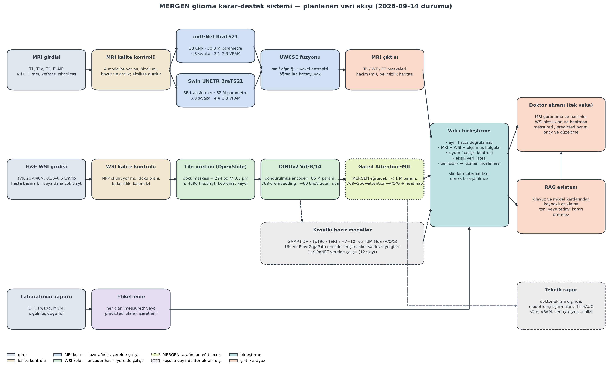

# Model rehberi ve sistem akışı

Bu bölüm, envanterdeki her modelin **ne işe yaradığını** ve planlanan sistemde **nerede
durduğunu** mühendislik diliyle anlatır. Tıbbi ayrıntı yalnız girdi/çıktıyı anlamak için
gereken kadar verilmiştir.

## 1. Beş kavram yeter

| Kavram | Mühendis karşılığı |
|---|---|
| MRI, 4 modalite (T1, T1c, T2, FLAIR) | Aynı beyin hacminin 4 ayrı "kanalı"; 240×240×155 voxel, 1 mm aralık. Modele 4 kanallı 3B görüntü olarak girer. |
| Segmentasyon, TC / WT / ET | Her voxel için maske. Üç iç içe bölge: WT (tümörün tamamı) ⊇ TC (çekirdek) ⊇ ET (kontrast tutan kısım). Başarı ölçüsü Dice = tahmin ile referans maskenin örtüşme oranı (0–1). |
| WSI, tile, embedding | WSI = 100.000 × 50.000 piksellik doku fotoğrafı. Doğrudan modele girmez; 224 px'lik **tile**'lara bölünür, her tile bir **embedding** (768 sayılık vektör) olur. |
| MIL (multiple instance learning) | Bir slaytın binlerce tile'ı bir "torba"dır; etiket torbaya aittir, tile'lara değil. Model hangi tile'ların önemli olduğunu (attention) kendisi öğrenir. |
| A / O / G ve measured / predicted | Doktorun ayırt etmesi gereken üç tümör tipi (astrositom, oligodendrogliom, glioblastom). Normalde laboratuvar testleri (IDH, 1p/19q) belirler. **measured** = laboratuvardan gelen gerçek değer, **predicted** = görüntüden model tahmini; ikisi asla aynı alana yazılmaz. |

### 1.1 A / O / G tam olarak nedir?

Üç sınıf, iki laboratuvar bayrağından türeyen bir karar tablosudur. Bayraklar: **IDH
mutasyonu var mı?** ve **1p/19q kodelesyonu var mı?** (iki kromozom kolunun birlikte
kaybı). Her ikisi de sekanslama/FISH ile ölçülür; model bunları görüntüden tahmin etmeye
çalışır.

| IDH mutasyonu | 1p/19q kodelesyonu | Sınıf | MERGEN kohortu (762) |
|---|---|---|---|
| var | var | **O** — oligodendrogliom | 162 |
| var | yok | **A** — astrositom | 255 |
| yok | — | **G** — glioblastom (IDH-wildtype) | 345 |

Mühendislik açısından: A/O/G üç sınıflı bir etikettir, referansı görüntü değil
laboratuvardır. WSI modeli bu etiketi H&E görüntüsünden tahmin eder; laboratuvar sonucu
varsa **ölçülen değer her zaman kazanır**, model çıktısı yalnız "predicted" alanında kalır.
G sınıfı klinikte en sık ve en agresif olandır; A ile O ayrımı tedavi planını değiştirir,
bu yüzden 1p/19qNET gibi ikili (A/O) modeller ayrıca vardır.

### 1.2 Hangi modeller kullanılacak? (karar, 2026-09-14)

| Karar | Bileşenler | Gerekçe |
|---|---|---|
| **Çekirdek** (üründe çalışır) | nnU-Net BraTS21, Swin UNETR BraTS21, UWCSE füzyonu, DINOv2 ViT-B/14, MERGEN Attention-MIL | MRI'da iki bağımsız uzman + tek çıktı; WSI'da açık lisanslı encoder + kendi eğittiğimiz A/O/G başlığı |
| **Koşullu** | TUM MoE/Mamba | Yayımlanmış en iyi hazır A/O/G modeli (TCGA testinde AUC 0,94, TCGA ile eğitilmemiş); Prov-GigaPath erişimi alınınca MIL'e alternatif/karşılaştırma |
| **Referans** (üründe yok) | GMAP, 1p/19qNET, ROAM, IUCompPath, MIL_Pretrained, AttentionDeepMIL | GMAP: UNI erişimi kurumsal e-posta ister ve modeli bizim hastalarımızla eğitilmiş; 1p/19qNET: yerelde çalıştı ama codeletion recall'u 0,33 ve lisansı yok; diğerleri kod/etiket referansı |
| **Çıkarıldı** | MONAI SegResNet BraTS18 | Depodaki eski bundle yapılandırması için indirilmişti; hız referansı dışında işlevi yoktu, hiçbir bileşen ona bağlı değil. Kayıt, paket ve rapordan kaldırıldı; `models/imaging/brats_mri_segmentation/` klasörü yalnız eski yapılandırma olarak duruyor |

WSI tarafındaki hazır modellerin kullanım amacı tek cümleyle: **kendi eğittiğimiz MIL'in
sonucunu karşılaştırmak ve doğrulamak**, üründe ikinci bir kara kutu çalıştırmak değil.
Bu yüzden yalnız TUM koşullu olarak tutuldu.

## 2. Modeller tek tek

### 2.1 MRI kolu

**nnU-Net BraTS21** — Girdi 4 kanallı MRI hacmi, çıktı voxel başına 5 sınıf olasılığı; bunlardan TC/WT/ET maskeleri türetilir. 3B evrişimli ağ (30,8 M parametre), BraTS 2021'in 1.251 vakasıyla eğitilmiş, 5 fold ağırlığı var. Rolü: **birincil MRI segmentasyon uzmanı**. Yerelde 4,6 s/vaka ve 3,1 GiB VRAM ile çalıştı; 5 fold birlikte 20 s. Ağırlık lisansı CC-BY-4.0.

**Swin UNETR BraTS21** — Aynı girdi/çıktı; farkı, 3B transformer tabanlı bir U-Net olması (62 M parametre). Aynı veri, farklı mimari olduğu için hataları nnU-Net'inkilerle tam örtüşmez; bu yüzden **ikinci uzman**. Yerelde 6,8 s/vaka, 4,4 GiB (rezerve 6,1 GiB). Apache-2.0.

**UWCSE** — Bir ağ değil, birleştirme kuralı. İki uzmanın olasılık haritalarını bölge bazlı ağırlıkla ortalar, voxel entropisinden belirsizlik haritası çıkarır ve son işleme uygular. Rolü: doktora gösterilen **tek MRI çıktısını** üretmek. Ağırlıkları öğrenilmez, ayrı bir doğrulama kümesinde bir kez sabitlenir; o küme (UCSF-PDGM'nin BraTS21-dışı vakaları) henüz yerelde yok.

**MONAI SegResNet BraTS18** — Kayıttan çıkarıldı (bkz. §1.2). Yerel çalıştırma sonucu yalnız geçmiş kayıt olarak `report/` altındaki eski sürümde kalmıştır.

### 2.2 WSI kolu

**DINOv2 ViT-B/14** — Genel amaçlı görüntü encoder'ı (86 M parametre, 142 M etiketsiz görüntüyle eğitilmiş). Her 224 px tile'ı 768 sayıya çevirir; **eğitilmez, dondurulur**. Patolojiye özel değil ama açık lisanslı ve TCGA görmemiş olduğu için veri sızıntısı riski yok. Yerelde gerçek slaytta 51–144 tile/s (darboğaz disk/JPEG çözme), yalnız GPU'da ~500 tile/s, 785 MiB VRAM.

**MERGEN Gated Attention-MIL** — Eğiteceğimiz **tek model**. Girdi: bir slaytın en fazla 4.096 tile embedding'i (4096 × 768). Çıktı: A/O/G olasılıkları ve tile başına attention ağırlığı (ısı haritası). Yapı: 768 → 256 → gated attention (128) → 3 sınıf; 1 M parametrenin altında. Eğitim verisi 762 TCGA slaytının embedding'leri (≈5 GiB); eğitim 1–4 saat, asıl maliyet embedding çıkarmak (762 slayt × ~75 s ≈ 16 saat tek süreç). Etiketlerimiz iki bağımsız WHO2021 listesiyle yüzde yüz uyuştu.

**1p/19qNET** — Hazır ağırlık. Girdi: slaytın ResNet50 (ImageNet) tile özellikleri; çıktı: 1p/19q codeletion olasılığı, yani IDH-mutant vakalarda **O mu A mı** sorusu. Yerelde 12 slaytta çalıştı: doğruluk 0,67, AUC 0,94, codeletion için precision 1,0 / recall 0,33 — upstream'in TCGA sonucuyla (recall 0,39) aynı davranış. Rolü: A/O ayrımında **ikinci görüş**; düşük recall nedeniyle tek başına karar verici değil. Depoda lisans yok.

**GMAP** — Hazır ağırlık; slayttan 4 moleküler işaretin (IDH, 1p/19q, TERT, +7/−10) olasılığını verir. Ancak tile özelliklerini **UNI** encoder'ından bekler; UNI ağırlıkları Hugging Face'te erişim onaylı ve ticari olmayan lisanslı. Ayrıca 762 hastamızın tamamı GMAP'in eğitim verisinde, yani kendi verimizde ölçemeyiz. Rolü: erişim alınırsa **"predicted marker" paneli**, laboratuvar sonucu gelene kadar ön bilgi.

**TUM MoE/Mamba** — Hazır ağırlık; WSI (ve varsa MRI) embedding'lerinden doğrudan A/O/G verir; TCGA'yı hiç görmeden 171 TCGA vakasında AUC 0,94. Yalnız-WSI yolu bizim MIL'in yapacağı işi yapar. Şartı: tile embedding'leri **Prov-GigaPath**'ten (erişim onaylı) ve mamba-ssm derlemesi. Rolü: erişim alınırsa MIL'e **hazır alternatif veya karşılaştırma ölçütü**.

**ROAM** — Hazır 5 checkpoint; 2048 px büyük bölgeler + piramit transformer ile alt tip/derece. GPL-3.0 ve eski yazılım yığını; yalnız **literatür referansı**.

**IUCompPath glioma-subtyping** — Model değil, karşılaştırma çerçevesi ve etiket listeleri; checkpoint yayımlamamış. Etiketlerini kendi etiketlerimizi doğrulamak (638/638 uyum) ve split tasarımı için kullandık.

**MIL_Pretrained** — 10 MIL toplayıcı için hazır başlangıç ağırlığı (sınıflandırıcı başlığı yok). MIL'imizi rastgele yerine buradan başlatmak denenebilir; girdi boyutu farkı (CONCH özellikleri) kontrol edilmeli. Lisans yok.

**AttentionDeepMIL** — MIT lisanslı referans kod; gated attention formülünü buradan alıyoruz.

**Prov-GigaPath ve UNI** — Patolojiye özel büyük encoder'lar. İndirilmedi: ikisi de Hugging Face'te hesapla koşul kabulü ister. TUM ve GMAP'in çalışması bunlara bağlı.

### 2.3 Kapsam dışı

**ESM-2 + XGBoost (eski genomik prototip)** — Sekanslanmış tek bir gen varyantının zararlı olup olmadığını puanlar; görüntü akışıyla ilgisi yok, çekirdek sistemden çıkarıldı.

**Doktor RAG asistanı** — Model eğitimi yok; onaylı kılavuz belgelerini ve model kartlarını indeksleyip kaynak göstererek açıklama üretir. Faz 3.

### 2.4 Attention-MIL eğitimi ne kadar sürer? (benchmark, RTX 5060 Ti)

`scripts/smoke/bench_attention_mil.py` ile gerçek boyutlu torbalarda (4.096 tile × 768, bf16
AMP, AdamW) ölçüldü; sonuç `mergen-wsi-attention-mil/smoke/attention_mil_train_benchmark.json`.

| Adım | Ölçüm | Toplam |
|---|---:|---:|
| Eğitim adımı (ileri + geri + optimizer), torba başına | 1,6 ms | — |
| Torbayı GPU'ya kopyalama (fp16, 6 MiB) | 1,0 ms | — |
| Bir epoch (533 eğitim slaytı) | 1,4 s | — |
| 40 epoch (erken durdurma ile tipik) | — | ≈ 1 dakika |
| 100 epoch (üst bütçe) + doğrulama | — | ≈ 3 dakika |
| Tepe VRAM (eğitim) | 191 MiB | — |
| Çıkarım, slayt başına (embedding hazırsa) | 0,3 ms | — |

Model 263.556 parametredir; eğitimin kendisi dakikalar sürer. Asıl maliyet embedding
çıkarımıdır: gerçek slaytta uçtan uca 51–144 tile/s ölçüldü (JPEG2000 slaytlar yavaş,
darboğaz disk/JPEG çözme). 762 slayt × 4.096 tile için tek süreçte **≈ 9–17 saat**;
4 paralel okuyucuyla **≈ 3–5 saat** beklenir. Bu adım bir kez yapılır ve fp16 embedding
dosyaları (≈ 4,5 GiB) saklanır; sonraki tüm eğitim denemeleri dakikalar sürer. Yani
"3–4 gün eğitim" değil, **yarım gün ön işleme + dakikalar süren eğitim** söz konusudur;
5-fold çapraz doğrulama bile toplam 15 dakikanın altındadır.

## 3. Sistem akışı



Adım adım:

1. **Girdi ve etiketleme.** Üç kaynak ayrı kapılardan girer: 4 modaliteli MRI (NIfTI), H&E slayt (.svs) ve laboratuvar raporu. Rapordaki değerler `measured`, modellerden çıkan her şey `predicted` etiketiyle saklanır.
2. **Kalite kontrolü.** MRI için 4 modalite var mı, hizalı mı, aralık 1 mm mi; WSI için MPP okunabiliyor mu, doku oranı, bulanıklık. Kontrolden geçmeyen girdi için sonuç üretilmez, hata döner.
3. **MRI kolu.** nnU-Net ve Swin UNETR aynı hacmi bağımsız işler; UWCSE ikisini birleştirip TC/WT/ET maskeleri, ml cinsinden hacimler ve belirsizlik haritası verir. Doktor tek bir sonuç görür; modellerin karşılaştırması teknik rapora gider.
4. **WSI kolu.** OpenSlide slaytı 0,5 µm/px'te 224 px tile'lara böler (koordinatlar saklanır, tile görüntüleri diske yazılmaz); DINOv2 her tile'ı 768-d vektöre çevirir; Attention-MIL torbayı A/O/G olasılığına ve ısı haritasına dönüştürür. GMAP/TUM, encoder erişimi alınırsa aynı noktaya paralel bağlanır.
5. **Vaka birleştirme.** MRI, WSI ve laboratuvar sonuçları aynı hastaya ait mi doğrulanır; uyum/çelişki ve eksik veri listesi çıkarılır; olasılıklar birbirine yakınsa "uzman incelemesi gerekli" işareti konur. Skorlar matematiksel olarak birleştirilmez, çünkü MRI ve WSI modelleri aynı hastalarla eğitilmedi.
6. **Doktor ekranı.** Tek vaka: MRI görünümü ve hacimler, WSI olasılıkları ve ısı haritası, measured/predicted ayrımı, onay ve düzeltme. Model isimleri ve Dice tabloları burada görünmez.
7. **RAG asistanı.** Doktorun sorusuna kılavuz ve model kartlarından kaynaklı cevap; tanı veya tedavi kararı üretmez, eksik veriyi söyler.
8. **Teknik rapor.** Bütün karşılaştırmalar, Dice/AUC, süre ve VRAM, veri çakışma analizleri jüri/geliştirici için ayrı tutulur.

## 4. Bugün ne hazır, ne eksik

| Parça | Durum |
|---|---|
| MRI: nnU-Net, Swin UNETR, SegResNet | Ağırlıklar doğrulandı, gerçek vakada çalıştı, süre/VRAM ölçüldü |
| UWCSE katsayıları | Kod var; doğrulama kümesi (UCSF-PDGM BraTS21-dışı) indirilmeli (Aspera) |
| WSI: DINOv2 | Gerçek slaytta çalıştı; 762 slaytın embedding'i henüz çıkarılmadı (~16 saat tek süreç) |
| WSI: Attention-MIL | **Eğitildi ve test edildi (koşu mil_v1, 2026-09-14):** 758 slaytın embedding'i 2 s 41 dk'da çıkarıldı (472 kare/s); 524 eğitim slaytı, 39 epoch (erken durdurma), en iyi epoch 24, toplam 3 dk. Doğrulama (115): macro-F1 0,881, AUROC 0,960. **Kilitli test (113, tek sefer): macro-F1 0,770 (GA 0,679–0,847), balanced acc 0,761, AUROC 0,903, MCC 0,671.** Hatalar A→G ve O→G yönünde, iki merkezde yoğun. v1 olarak donduruldu; iyileştirmeler TCGA-dışı veriyle doğrulanacak |
| 1p/19qNET | Yerelde çalıştı; referans olarak tutuluyor, üründe yok |
| TUM (koşullu) | Ağırlıklar indi; Prov-GigaPath için Hugging Face'te tek tıklık kabul gerekiyor |
| GMAP (referans) | UNI erişimi kurumsal e-posta ister; bizim TCGA hastalarımızla eğitildiği için yerel test olamaz |
| Vaka birleştirme, doktor ekranı, RAG | Tasarlandı, uygulanmadı |

### 4.1 Eğitimi başlatma sırası

```bash
cd models/pathology/mil
./run_training.sh extract          # tüm kohort embedding'i; Ctrl+C güvenli, kaldığı yerden devam eder (3–6 saat)
./run_training.sh extract-status   # ilerleme ve ETA
./run_training.sh train mil_v1     # checkpoint'li eğitim; kesilirse aynı komut kaldığı yerden sürer (dakikalar)
./run_training.sh eval mil_v1 val  # doğrulama; test'i en son, bir kez
```

Ayrıntılar ve veri dağılımı kararları: `models/pathology/mil/README.md`.
