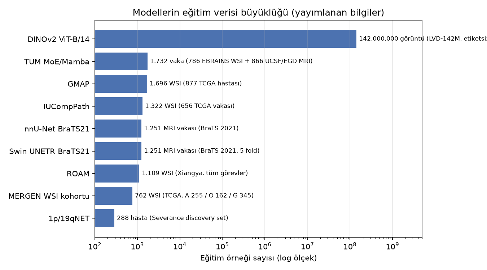
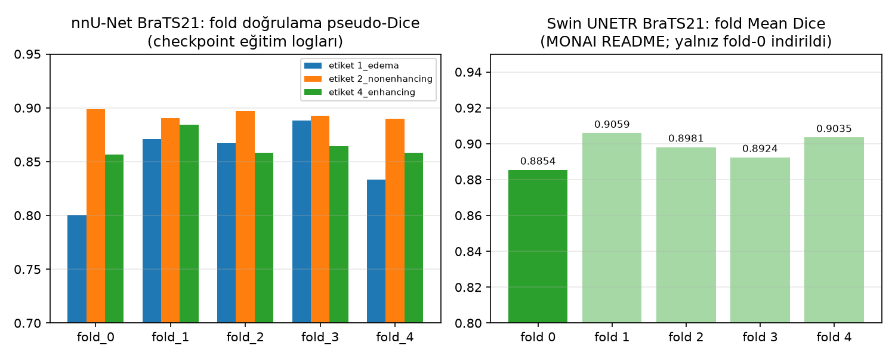
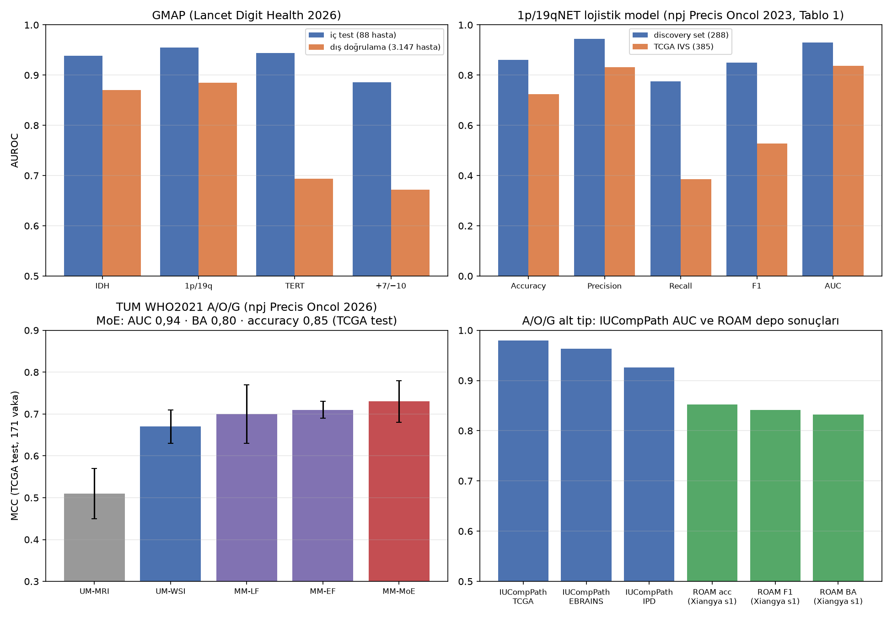
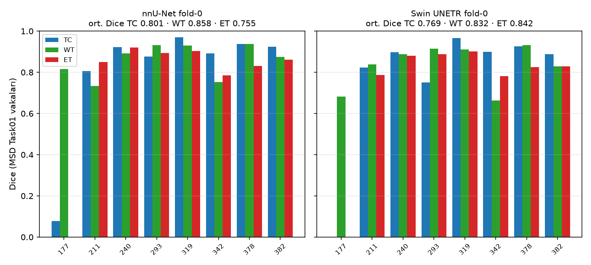
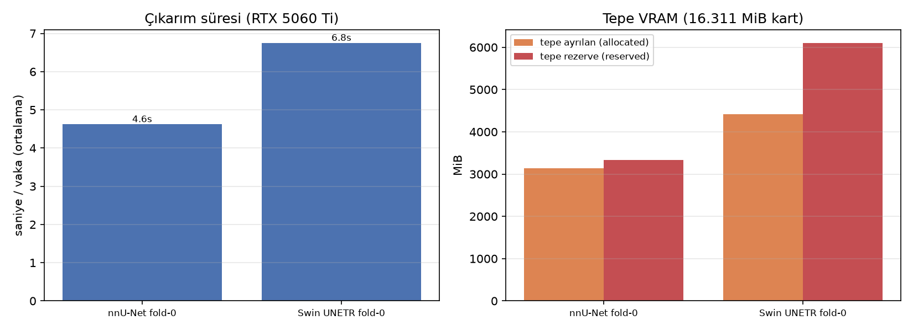
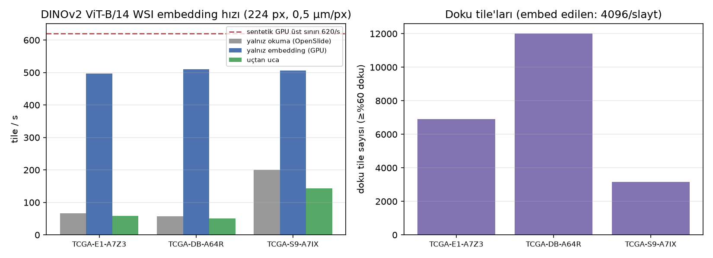
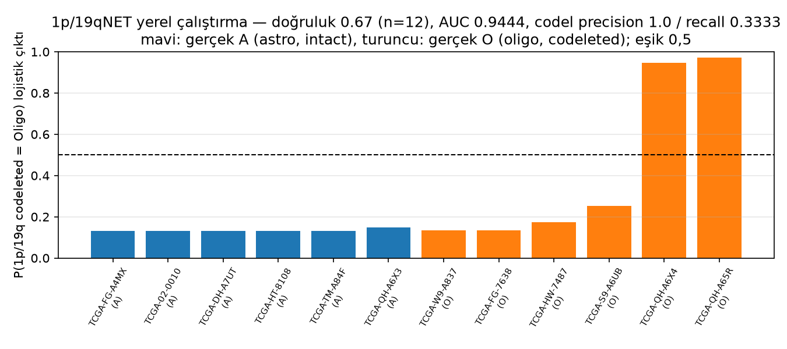
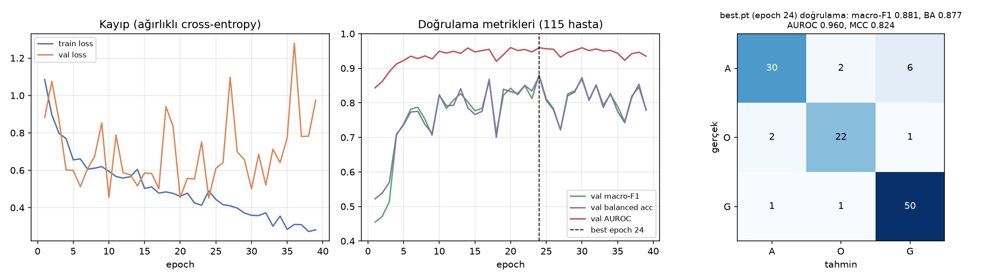

# MERGEN model raporu — eğitim verileri, yayımlanmış skorlar ve yerel çalıştırma sonuçları

Üretim tarihi: 2026-09-14. Kaynak dosyalar: `models/registry/<model>/metrics.json`, `data_distribution.json`, `smoke/*.json`. Tüm yayımlanmış sayılar kaynağıyla model kartlarında listelenmiştir; yerel sonuçlar bu makinede (RTX 5060 Ti 16 GB, torch 2.14.0+cu130) üretilmiştir.

## 1. Özet

- Yayımlanmış eğitim verileri ve skorlar 11 bileşen için derlendi; F1/precision/recall yalnız bunları raporlayan çalışmalarda (1p/19qNET, ROAM depo sonuçları) mevcuttur, diğerleri Dice/AUC/MCC bildirir.
- Kullanılacak iki MRI modeli (nnU-Net, Swin UNETR) etiketli gerçek vakalarda çalıştırıldı (MSD Task01 BrainTumour, BraTS 2016/17 kökenli); Dice, süre ve VRAM ölçüldü. Bu vakalar BraTS 2021 eğitim verisiyle örtüşebildiği için sonuçlar bağımsız test değil, çalışırlık ve tutarlılık kontrolüdür. MONAI SegResNet referansı ürün kararıyla kayıttan çıkarıldı.
- DINOv2 encoder gerçek TCGA slaytlarında uçtan uca (OpenSlide → tile → embedding) çalıştırıldı ve gerçek hız ölçüldü.
- 1p/19qNET hazır ağırlıkları yerel TCGA IDH-mutant slaytlarında çalıştırıldı: doğruluk 0.67 (n=12).
- MERGEN Attention-MIL (mil_v1) eğitildi: doğrulama macro-F1 0,881; kilitli testte (n=113, tek sefer) macro-F1 0.770, AUROC 0.903. v1 donduruldu.
- GMAP ve TUM checkpointleri yüklendi fakat çalıştırılamadı: gerekli UNI / Prov-GigaPath encoder ağırlıkları Hugging Face erişim onayı gerektirir.

## 2. Eğitim verisi büyüklükleri

| Model | Eğitim örneği | Birim / kaynak |
|---|---|---|
| DINOv2 ViT-B/14 | 142.000.000 | görüntü (LVD-142M, etiketsiz) |
| TUM MoE/Mamba | 1.732 | vaka (786 EBRAINS WSI + 866 UCSF/EGD MRI) |
| GMAP | 1.696 | WSI (877 TCGA hastası) |
| IUCompPath | 1.322 | WSI (656 TCGA vakası) |
| nnU-Net BraTS21 | 1.251 | MRI vakası (BraTS 2021) |
| Swin UNETR BraTS21 | 1.251 | MRI vakası (BraTS 2021, 5 fold) |
| ROAM | 1.109 | WSI (Xiangya, tüm görevler) |
| MERGEN WSI kohortu | 762 | WSI (TCGA, A 255 / O 162 / G 345) |
| 1p/19qNET | 288 | hasta (Severance discovery set) |

## 3. Yayımlanmış (upstream) skorlar

### 3.1 MRI segmentasyonu

| Model | Kohort | Skor | Kaynak |
|---|---|---|---|
| nnU-Net BraTS21 | fold doğrulama pseudo-Dice (5 fold ort.) | EMA fg 0.8691; etiket1 0.8521, etiket2 0.8936, ET 0.8643 | checkpoint logları (Zenodo yayımlanmış metrik vermez) |
| Swin UNETR BraTS21 | BraTS21 fold 0–4 doğrulama | Mean Dice 0,8854 / 0,9059 / 0,8981 / 0,8924 / 0,9035 | MONAI README |

### 3.2 WSI / moleküler / alt tip

| Model | Kohort | Skor | Kaynak |
|---|---|---|---|
| TUM MoE (WSI+MRI) | TCGA bağımsız test (171) | AUC 0,94 · BA 0,80 · accuracy 0,85 · MCC 0,73 ± 0,05 | Saueressig et al. 2026 |
| TUM yalnız-WSI | TCGA test | MCC 0,67 ± 0,04; sınıf doğruluğu GBM 0,87 / Astro 0,75 / Oligo 0,72 | aynı, Tablo 2 |
| GMAP | iç test (88 hasta) | AUROC IDH 0,939 · 1p/19q 0,955 · TERT 0,944 · +7/−10 0,886 | Han et al. 2026 |
| GMAP | dış doğrulama (3.147 hasta) | AUROC 0,870 · 0,885 · 0,694 · 0,672 | aynı |
| IUCompPath (en iyi FM+AM) | TCGA / EBRAINS / IPD | AUC 0,9795 / 0,9630 / 0,9261 | Innani et al. 2026 |
| 1p/19qNET lojistik | discovery (288) | Acc 0,861 · Prec 0,944 · Rec 0,776 · F1 0,850 · AUC 0,930 | Kim et al. 2023, Tablo 1 |
| 1p/19qNET lojistik | TCGA IVS (385) | Acc 0,725 · Prec 0,831 · Rec 0,386 · F1 0,527 · AUC 0,837 | aynı |
| ROAM (3 sınıf) | Xiangya in-house test, seed s1 | Acc 0,852 · Prec 0,852 · Rec 0,833 · F1 0,842 · BA 0,833 | depo results/metrics.json |
| DINOv2 ViT-B/14 | ImageNet-1k | k-NN 82,1 % · linear 84,5 % | DINOv2 README |

F1/precision/recall yayımlamayan çalışmalar için bu değerler uydurulmadı; makale eklerinde kalan sayılar (TUM Tablo S1, GMAP F1/sens/spec, IUCompPath F1/BA) açık erişimli olmadığından rapora alınmadı.

## 4. Yerel çalıştırma sonuçları

MRI vakaları: MSD Task01 BrainTumour (lisans CC-BY-SA 4.0, 484 eğitim vakasından tohum 20260914 ile 8 vaka). Etiketler BraTS kuralına (1 NCR, 2 ED, 4 ET) yeniden eşlendi. Bu vakalar BraTS 2016/17 kökenlidir ve modellerin BraTS 2018/2021 eğitim kümeleriyle örtüşmesi olasıdır; Dice değerleri **bağımsız test değildir**.

| Model | Parametre | Dice TC ort. | Dice WT ort. | Dice ET ort. | süre/vaka · tepe VRAM |
|---|---|---|---|---|---|
| nnU-Net fold-0 | 30.791.001 | 0.801 (medyan 0.907, n=8) | 0.858 (medyan 0.883, n=8) | 0.755 (medyan 0.855, n=8) | 4.6 s / 3135 MiB (rez. 3330) |
| Swin UNETR fold-0 | 62.191.941 | 0.769 (medyan 0.893, n=8) | 0.832 (medyan 0.863, n=8) | 0.842 (medyan 0.829, n=7) | 6.8 s / 4411 MiB (rez. 6102) |
| nnU-Net 5-fold ensemble | 30.791.001 | 0.798 (medyan 0.909, n=8) | 0.851 (medyan 0.883, n=8) | 0.754 (medyan 0.849, n=8) | 20.2 s / 3135 MiB (rez. 3330) |

Ortalama ile medyan arasındaki fark tek bir vakadan (BRATS_177: tümör çekirdeği ve kontrastlanan bölge referansta neredeyse yok) kaynaklanır; boş referans bölgelerinde Dice tanımsız (n düşer) veya yanlış-pozitiflerle 0 olur.

nnU-Net fold-0: vaka bazlı sonuçlar

| Vaka | TC | WT | ET | s | VRAM MiB | GT hacim ml (TC/WT/ET) | Tahmin hacim ml |
|---|---|---|---|---|---|---|---|
| BRATS_177 | 0.078 | 0.815 | 0.000 | 7.828 | 3135 | 0.09/12.85/0.0 | 2.33/12.59/1.85 |
| BRATS_211 | 0.805 | 0.733 | 0.849 | 4.672 | 1492 | 23.32/58.27/14.17 | 16.91/35.19/15.32 |
| BRATS_240 | 0.922 | 0.892 | 0.920 | 2.655 | 1465 | 79.16/194.25/59.5 | 70.33/165.51/68.05 |
| BRATS_293 | 0.878 | 0.933 | 0.894 | 4.503 | 1506 | 9.33/63.06/8.22 | 8.06/66.96/7.8 |
| BRATS_319 | 0.970 | 0.929 | 0.902 | 2.659 | 1465 | 36.91/73.44/17.43 | 37.82/77.68/18.64 |
| BRATS_342 | 0.893 | 0.752 | 0.786 | 4.872 | 1497 | 3.46/29.24/2.04 | 3.15/19.91/1.86 |
| BRATS_378 | 0.938 | 0.937 | 0.830 | 4.866 | 1499 | 27.56/57.08/17.51 | 28.13/56.65/23.74 |
| BRATS_382 | 0.923 | 0.874 | 0.861 | 4.913 | 1495 | 11.93/30.65/9.62 | 10.93/25.82/8.29 |

Swin UNETR fold-0: vaka bazlı sonuçlar

| Vaka | TC | WT | ET | s | VRAM MiB | GT hacim ml (TC/WT/ET) | Tahmin hacim ml |
|---|---|---|---|---|---|---|---|
| BRATS_177 | 0.000 | 0.682 | – | 7.09 | 4309 | 0.09/12.85/0.0 | 0.0/6.94/0.0 |
| BRATS_211 | 0.824 | 0.839 | 0.786 | 6.898 | 4411 | 23.32/58.27/14.17 | 23.97/51.18/21.08 |
| BRATS_240 | 0.898 | 0.888 | 0.881 | 6.432 | 4411 | 79.16/194.25/59.5 | 85.09/218.47/75.36 |
| BRATS_293 | 0.751 | 0.915 | 0.887 | 5.936 | 4411 | 9.33/63.06/8.22 | 11.89/70.73/7.42 |
| BRATS_319 | 0.965 | 0.911 | 0.902 | 6.699 | 4411 | 36.91/73.44/17.43 | 38.67/82.81/19.34 |
| BRATS_342 | 0.900 | 0.663 | 0.781 | 6.985 | 4411 | 3.46/29.24/2.04 | 3.16/15.12/1.56 |
| BRATS_378 | 0.926 | 0.931 | 0.825 | 7.012 | 4411 | 27.56/57.08/17.51 | 29.8/60.51/24.39 |
| BRATS_382 | 0.888 | 0.829 | 0.829 | 6.947 | 4411 | 11.93/30.65/9.62 | 10.07/25.25/7.38 |

### 4.1 DINOv2 encoder — gerçek WSI

| Slayt | Boyut (px) | MPP | doku tile | embed | okuma t/s | embed t/s | uçtan uca t/s | tepe VRAM MiB | embedding dosyası |
|---|---|---|---|---|---|---|---|---|---|
| TCGA-E1-A7Z3-01Z-00-DX1 | 105139×53260 | 0.25 | 6912 | 4096 | 67.0 | 497.1 | 59.0 | 785 | 6.0 MiB |
| TCGA-DB-A64R-01Z-00-DX1 | 89639×52712 | 0.247 | 12010 | 4096 | 56.7 | 509.6 | 51.0 | 785 | 6.0 MiB |
| TCGA-S9-A7IX-01Z-00-DX1 | 111551×33378 | 0.2527 | 3166 | 3166 | 200.7 | 506.7 | 143.7 | 785 | 4.6 MiB |

Sentetik girdiyle GPU üst sınırı 620 tile/s (bf16, batch 64, 978 MiB). Gerçek slaytta darboğaz OpenSlide okuma/JPEG çözmedir.

### 4.2 1p/19qNET — yerel TCGA IDH-mutant slaytları

Doğruluk 0.667 (n=12; A: 6/6, O: 2/6); codeletion (Oligo) için AUC 0.9444, precision 1.0, recall 0.3333, F1 0.5. Karşılaştırma: upstream TCGA IVS (385) precision 0,831 / recall 0,386 / F1 0,527 / AUC 0,837. Reproduction check on TCGA slides that overlap the upstream independent validation set; tile subsampling (max 6000 tissue tiles, edge-filtered) and no stain normalisation differ from upstream. Class orientation corrected on 2026-09-14 after inspecting the shipped logistic model (class 1 = codeleted).

| Hasta | Gerçek | Alt tip | Grade | tile (doku/örnek/filtre) | p 1pNET | p 19qNET | P(codel) | Tahmin | s | VRAM MiB |
|---|---|---|---|---|---|---|---|---|---|---|
| TCGA-02-0010 | A | IDHmut-non-codel | G4 | 12272/6000/3296 | 0.9944 | 0.9923 | 0.1324 | A | 25.1 | 1438 |
| TCGA-DH-A7UT | A | IDHmut-non-codel | G3 | 13834/6000/5434 | 0.9943 | 0.992 | 0.1325 | A | 49.8 | 1496 |
| TCGA-FG-A4MX | A | IDHmut-non-codel | G2 | 21004/6000/5841 | 0.9944 | 0.9925 | 0.1322 | A | 53.6 | 1512 |
| TCGA-HT-8108 | A | IDHmut-non-codel | G2 | 6503/6000/5290 | 0.9942 | 0.9917 | 0.1327 | A | 44.7 | 1516 |
| TCGA-QH-A6X3 | A | IDHmut-non-codel | G2 | 17038/6000/5875 | 0.9788 | 0.9737 | 0.1476 | A | 49.3 | 1511 |
| TCGA-TM-A84F | A | IDHmut-non-codel | G3 | 22639/6000/5951 | 0.9941 | 0.9917 | 0.1327 | A | 50.7 | 1516 |
| TCGA-FG-7638 | O | IDHmut-codel | G3 | 13168/6000/3604 | 0.9909 | 0.9921 | 0.1339 | A | 87.3 | 1516 |
| TCGA-HW-7487 | O | IDHmut-codel | G2 | 15779/6000/4565 | 0.9829 | 0.9181 | 0.1727 | A | 97.1 | 1498 |
| TCGA-QH-A65R | O | IDHmut-codel | G3 | 14640/6000/5764 | 0.2333 | 0.2959 | 0.9713 | O | 49.4 | 1506 |
| TCGA-QH-A6X4 | O | IDHmut-codel | G3 | 17130/6000/5917 | 0.2717 | 0.4282 | 0.9476 | O | 49.7 | 1515 |
| TCGA-S9-A6UB | O | IDHmut-codel | G2 | 29038/6000/1829 | 0.9518 | 0.8178 | 0.2527 | A | 43.2 | 1516 |
| TCGA-W9-A837 | O | IDHmut-codel | G2 | 14177/6000/5768 | 0.9922 | 0.9915 | 0.1336 | A | 47.2 | 1484 |

### 4.3 MERGEN Attention-MIL — eğitim sonucu (koşu mil_v1)

Eğitim: 524 slayt (A 178 / O 112 / G 234), doğrulama 115 slayt; kalite eşiği 100 kare (train'de 8 slayt dışlandı). 39 epoch çalıştı, erken durdurma ile en iyi epoch 24; toplam eğitim süresi 183 s.

| Metrik | Doğrulama (n=115) | %95 GA | Test, kilitli, tek sefer (n=113) | %95 GA |
|---|---|---|---|---|
| macro_f1 | 0.881 | 0.815–0.936 | 0.770 | 0.679–0.847 |
| balanced_accuracy | 0.877 | 0.811–0.935 | 0.761 | 0.681–0.843 |
| auroc_macro_ovr | 0.960 | 0.929–0.984 | 0.903 | 0.855–0.944 |
| mcc | 0.824 | 0.733–0.905 | 0.671 | 0.541–0.775 |
| accuracy | 0.887 | 0.826–0.939 | 0.788 | 0.708–0.858 |

| Sınıf | val precision | val recall | val F1 | test precision | test recall | test F1 |
|---|---|---|---|---|---|---|
| A | 0.909 | 0.789 | 0.845 | 0.867 | 0.684 | 0.765 |
| O | 0.880 | 0.880 | 0.880 | 0.739 | 0.680 | 0.708 |
| G | 0.877 | 0.962 | 0.917 | 0.767 | 0.920 | 0.836 |

Test karışıklık matrisi (satır gerçek A/O/G, sütun tahmin): [[26, 4, 8], [2, 17, 6], [2, 2, 46]]. Test bölmesi model seçiminden sonra **bir kez** değerlendirildi; doğrulama ile test arasındaki fark (macro-F1 0.881 → 0.770) doğrulamada model seçiminin iyimserliğini ve merkez/boyama farklarını yansıtır; test güven aralığı raporlanan değerdir. Hatalar ağırlıklı olarak A→G ve O→G yönündedir ve iki merkezde (Case Western St Joes, Henry Ford) yoğunlaşır.

### 4.4 Çalıştırılamayan modeller

- **GMAP:** checkpointler yüklendi (4 × 4,83 M parametre) fakat UNI tile özellikleri gerekir; UNI ağırlıkları Hugging Face'te erişim onaylı ve CC-BY-NC-ND-4.0.
- **TUM MoE/Mamba:** 10 checkpoint yüklendi (246.761 parametre) fakat Prov-GigaPath (erişim onaylı) + MM-DINOv2 embeddingleri ve mamba-ssm derlemesi gerekir.
- **ROAM:** GPL-3.0; Python 3.8 / PyTorch 1.12 / spams yığını ve 3 ölçekli 2048 px ROI hattı gerektirir; bu turda kurulmadı.
- **MIL_Pretrained / IUCompPath:** görev başlığı veya checkpoint yok; çalıştırılacak sınıflandırıcı bulunmuyor.

## 5. Sınırlamalar

- MRI Dice değerleri eğitim-verisiyle örtüşmesi olası vakalarda ölçüldü; bağımsız (UCSF-PDGM BraTS21-dışı) test için veri Aspera ile indirilmelidir.
- 1p/19qNET sonuçları tile alt-örnekleme ve stain normalizasyonu olmadan üretildi; upstream ile birebir aynı ön işleme değildir.
- DINOv2 hızları tek slayt/tek süreç ölçümüdür; çok işçili okuma ile artırılabilir.

## 6. Dosyalar

- Kartlar ve kaynaklı metrikler: `models/registry/<model>/MODEL_CARD.md`, `metrics.json`
- Yerel sonuç JSON'ları: `models/registry/<model>/smoke/`
- Betikler: `models/registry/scripts/smoke/*.py`, `models/registry/scripts/make_report.py`
